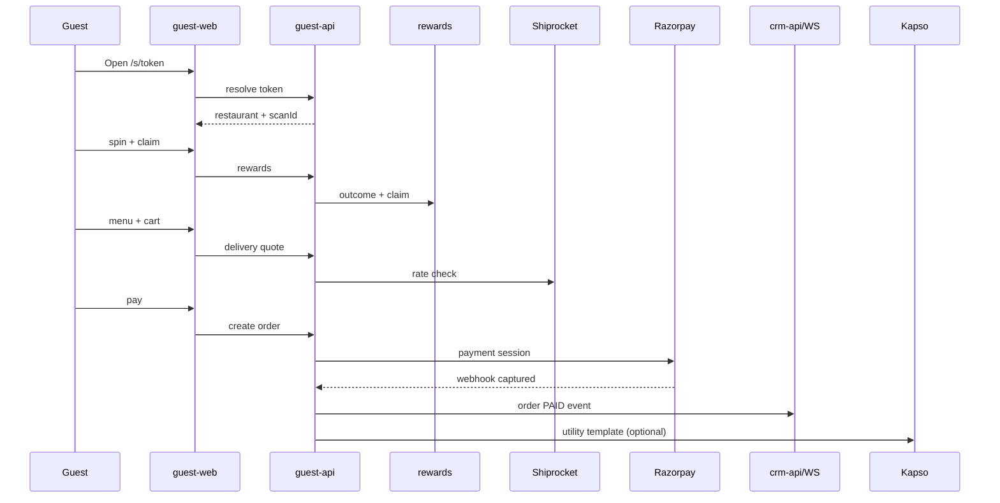
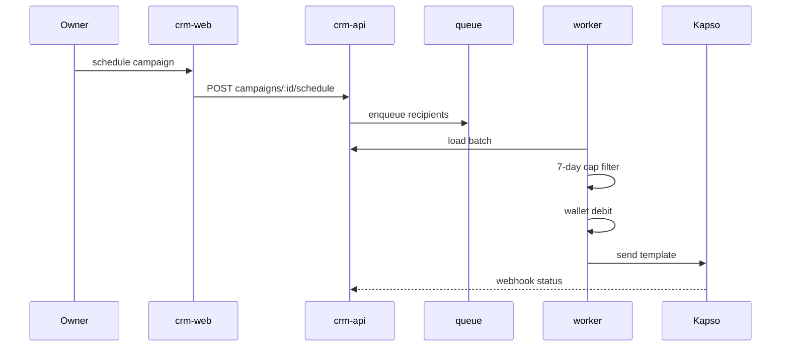

# D'aMigo's — Flow Diagrams

## Scan to paid order

```mermaid
sequenceDiagram
  participant G as Guest
  participant GW as guest-web
  participant API as guest-api
  participant R as rewards
  participant SR as Shiprocket
  participant RZ as Razorpay
  participant K as crm-api/WS
  participant WA as Kapso

  G->>GW: Open /s/token
  GW->>API: resolve token
  API-->>GW: restaurant + scanId
  G->>GW: spin + claim
  GW->>API: rewards
  API->>R: outcome + claim
  G->>GW: menu + cart
  GW->>API: delivery quote
  API->>SR: rate check
  G->>GW: pay
  GW->>API: create order
  API->>RZ: payment session
  RZ-->>API: webhook captured
  API->>K: order PAID event
  API->>WA: utility template (optional)
```

## CRM campaign send

```mermaid
sequenceDiagram
  participant O as Owner
  participant CW as crm-web
  participant API as crm-api
  participant Q as queue
  participant W as worker
  participant K as Kapso

  O->>CW: schedule campaign
  CW->>API: POST campaigns/:id/schedule
  API->>Q: enqueue recipients
  W->>API: load batch
  W->>W: 7-day cap filter
  W->>W: wallet debit
  W->>K: send template
  K-->>API: webhook status
```
